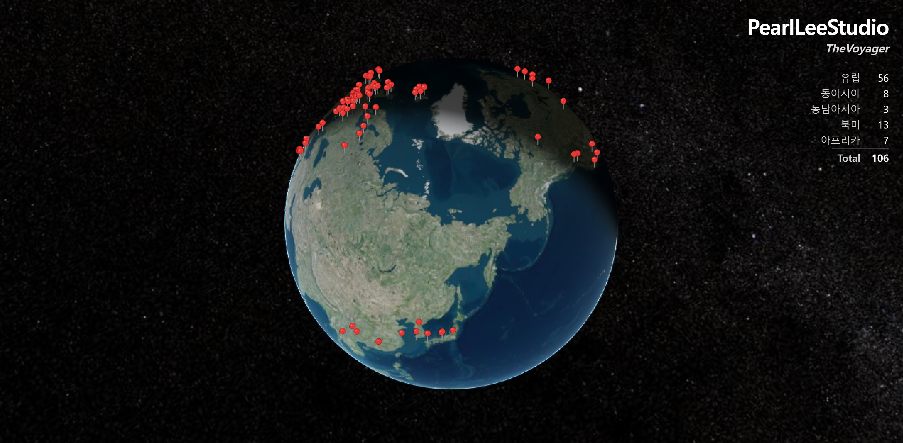
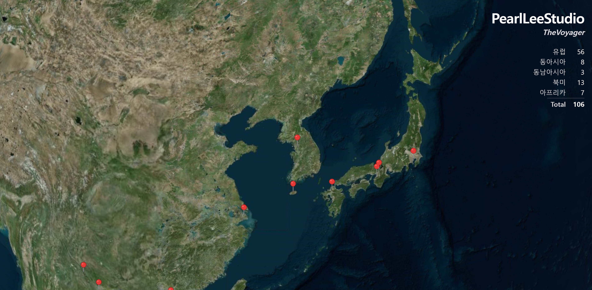

<h1 align="center">TheVoyager</h1>

<p align="center">
  <em>"What does this place sound like to <strong>you</strong>, on this day, with this memory?"</em>
</p>

<p align="center">
  
  <a href="https://github.com/PearlLeeStudio/TheArtist"></a>
  <a href="https://huggingface.co/PearlLeeStudio"></a>
  <a href="LICENSE"></a>
  
</p>

<p align="center">
  
</p>

<p align="center"><sub>
A decade of travel diaries as a playable map — every pin is one visit, every visit has its own song.
</sub></p>

## This repository is an exhibit

TheVoyager is a **single-person instrument**. It ingests the author's own
Threads travel diary — text and photographs — interprets each visit with a
vision LLM, and turns that interpretation into a song. The pipeline is
fitted to one person's memory and one person's way of writing it down;
today it is not a service, and it plays only the author's archive (see
[Roadmap](#roadmap)).

Accordingly, this repository documents the work rather than distributing
it:

- **The piece itself is live** — [thevoyager.pages.dev](https://thevoyager.pages.dev):
  the full map, every diary, every song.
- **No source.** The implementation — Threads ingestion, vision-LLM
  interpretation, music derivation, accompaniment realization, audio
  render, and the map frontend — is private.
- **No credentials.** Nothing in this repository connects to anything.

If you want a system you can actually run, see
**[TheArtist](https://github.com/PearlLeeStudio/TheArtist)** — the music
engine behind this work — which is published as a runnable demo app.

## Links

| | |
|---|---|
| 🌍 **The piece, live** | [thevoyager.pages.dev](https://thevoyager.pages.dev) — spin the globe, click a pin, listen |
| 🎼 **Music engine** | [github.com/PearlLeeStudio/TheArtist](https://github.com/PearlLeeStudio/TheArtist) |
| 🤗 **Released models** | [huggingface.co/PearlLeeStudio](https://huggingface.co/PearlLeeStudio) |
| 💼 **Author** | [linkedin.com/in/pearlmedicilee](https://www.linkedin.com/in/pearlmedicilee) |

## What it is

A map-based memory–music piece. Ten years of the author's travel diaries —
100+ visits across ~90 cities, posted as photo-and-text threads — become a
3D globe of pins. Clicking a pin opens that visit's diary as a photo
slideshow, and an iPod plays the song generated from that specific memory.
The same city visited twice yields two different songs: the **visit**, not
the place, is the unit of memory.

## The music engine is TheArtist

All music in TheVoyager is generated by **TheArtist**, the author's
separately published chord-generation engine — a custom-trained Music
Transformer with per-genre adapters (weights on
[HuggingFace](https://huggingface.co/PearlLeeStudio), code at
[PearlLeeStudio/TheArtist](https://github.com/PearlLeeStudio/TheArtist)).

The boundary is strict, and it is a design decision:

- **TheArtist is a chord generator.** TheVoyager calls it over HTTP
  (`POST /api/generate/song`) and uses **only the returned chord
  progression**.
- **TheVoyager realizes the accompaniment.** Genre-specific comping, bass,
  and drum patterns, voice-leading voicings, humanization, and the final
  audio render are TheVoyager's own layer.

## How it works

```
[Stage 1 — ingestion]
  Threads API → root post + reply chain → visit rows + photos

[Stage 2 — interpretation]
  visit (journal text + photos) → vision LLM
  → VisitInterpretation: a distribution over 13 genres
    + intensity / valence / density scalars + sub-style + reasoning
  → cached as an inspectable, editable record — the curation surface

[Stage 3 — music]
  interpretation → deterministic derive (seeded genre pick, length from
  diary length, scalar carry) → TheArtist /api/generate/song
  → chord progression → realization (comping / bass / drums)
  → MIDI → sampler → WAV → the iPod on the map
```

The genre vocabulary (shared with TheArtist):
`jazz · pop · rock · blues · bossa · classical · country · rnb_soul ·
hip_hop · electronic · funk · folk · gospel`

Across the current archive all 13 genres appear — the vision LLM reads
each memory differently enough that a decade of diaries spreads over the
full vocabulary.

## Design notes

- **memory → controls → harmony → audio.** There is no direct
  memory-to-audio mapping. The middle is an explicit, human-readable
  symbolic control layer: the interpretation of every visit can be read,
  edited, and regenerated.
- **The visit is canonical.** Same city, different visit, different song.
  Same visit, same song — generation is seed-deterministic from the visit
  identity.
- **Two render-side personalization axes.** Visit scalars condition the
  audio render directly: instrument overrides per (genre, intensity,
  valence) bucket, and an intensity → velocity-contrast dynamics lever.
  Editing one scalar on a fixed symbolic input measurably changes the
  output audio.
- **Rule-based realization, deliberately.** The accompaniment realization
  is pattern-table based and stops short of learned arrangement — pushing
  that into TheArtist would break its identity as a chord generator. The
  tables are the author's tuning surface.

<p align="center">
  
</p>

## Roadmap

**Any user's posts.** The system is planned to generalize beyond the
author's archive: connect your own Threads account, and the map plays
*your* diary. The current parsing and interpretation layers are
deliberately fitted to one person's writing conventions, so
generalization — account connection, format-agnostic parsing, per-user
data — is its own engineering chapter: planned, not dated.

## License

**View-only.** © 2026 Jinju Lee (PearlLeeStudio). Published for viewing
and reference as a portfolio exhibit; no use, copy, modification, or
distribution rights are granted. See [LICENSE](LICENSE).
